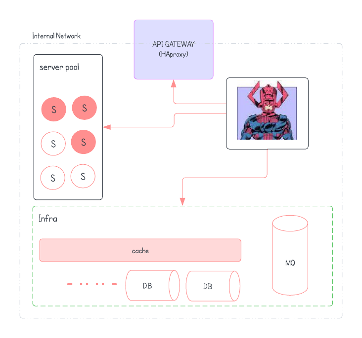

# Galactus
🥴

## Arch

<p align=center>
    
</p>

- As the figure above depcits, Galactus has full knowledge about the infra structure and also controllers the server pool and the api gateway.
- The API gateway cotains two parts (forntend, backend), which enables it to do loadbalancing across specific backends.

# Setup
- the infra structure is composed in a docker-compose.yaml file inside the `playspace` folder
- just call `docker compose up controller -d`
- after than you will need to put the database adminstrator hat and go into the `metadb` and `database-user` containers and create the essential.
- 🎉 you have the full infra structure under your controller

## Deployment & continus deliver
- to deploy a service you just need to call the right controller api, example of deploying the user service:
```bash
curl \
    -F file=@target/dep-0.0.1-SNAPSHOT.jar \
    -F propsFile=@production.properties \
    -F data='{
        "name": "user",
        "port": "8080",
        "maxInstanceCount": 2,
        "deps": []
    }' \
    http://localhost:8080/v1/service/deploy
```
> NOTE: cli client is comming SOON.
- then follows the continus delivery:
```bash
curl \
    -F file=@target/dep-0.0.1-SNAPSHOT.jar \
    -F propsFile=@production.properties \
    -F data='{
        "name": "user",
        "port": "8080",
        "maxInstanceCount": 2,
        "deps": []
    }' \
    http://localhost:8080/v1/service/deploy
```

## Service state controll
- Also fairly simple:
    - freeze:
    ```bash
    curl localhost:8080/v1/service/freeze/{serviceName}
    ```
    - continue:
    ```bash
    curl localhost:8080/v1/service/continue/{serviceName}
    ```
    - shutdown:
    ```bash
    curl localhost:8080/v1/service/shutdown/{serviceName}
    ```